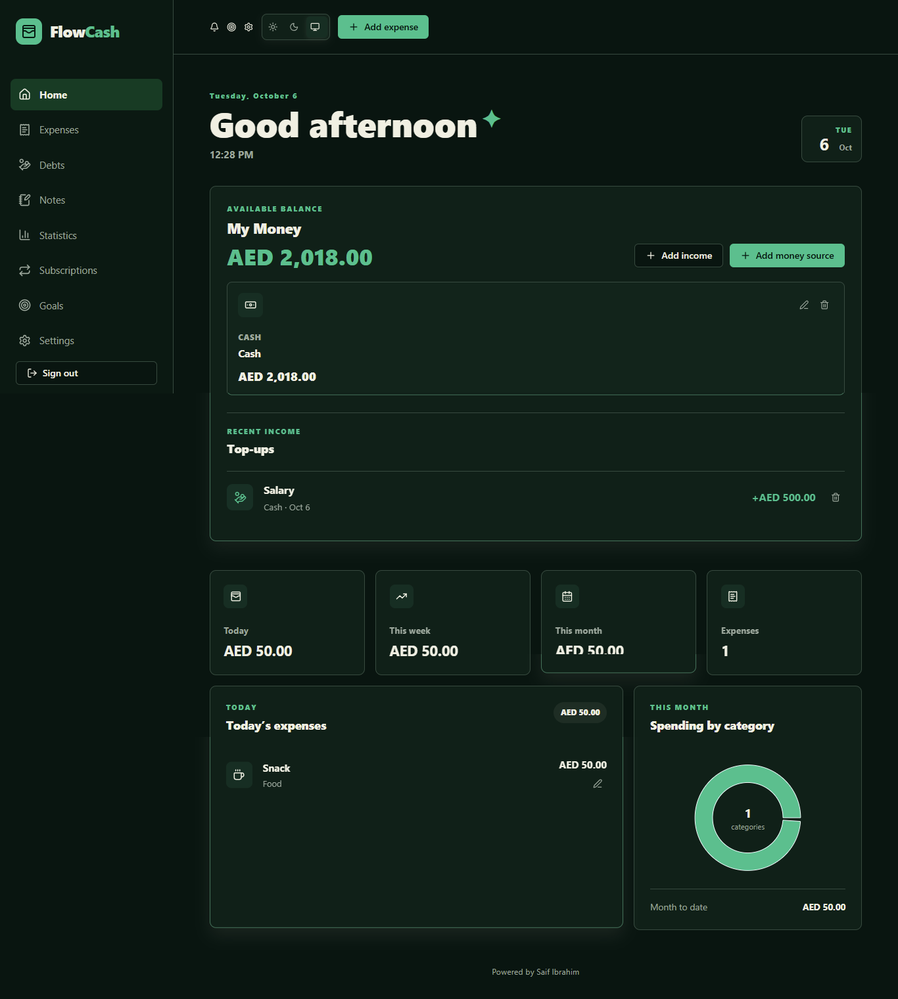
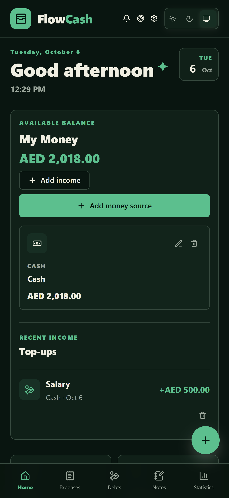
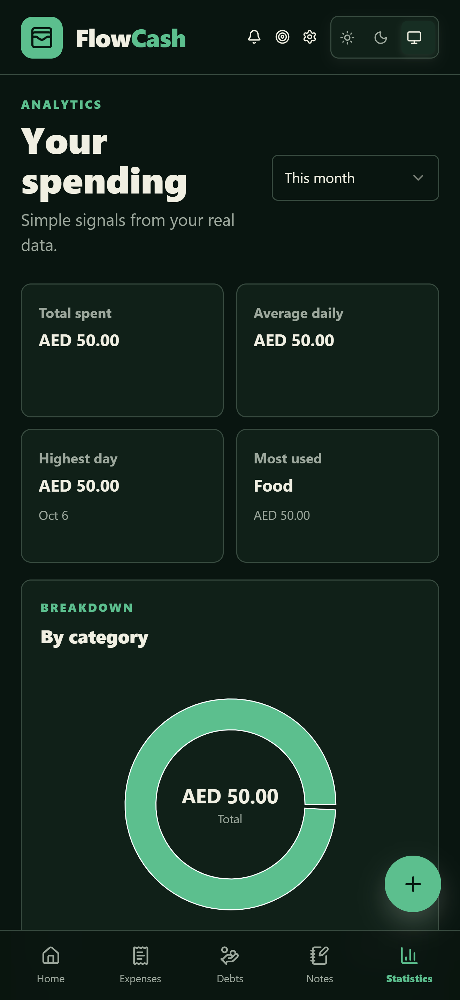
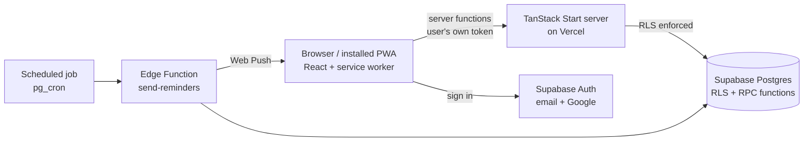

# Flow Cash

**A personal finance app that tracks expenses, accounts in multiple currencies, subscriptions, debts and savings goals, and keeps working offline.**

 

<!-- Hero image: desktop dashboard (see "Recommended Screenshots" in the guide) -->

> **Portfolio showcase.** This repository presents the project through screenshots and write-ups. The source code is private.

---

## Overview

Flow Cash is a full-stack personal finance tracker I designed and built end to end. It replaces the usual mix of notes, spreadsheets and memory with one private app: you log expenses against real accounts (cash, card, bank, wallet), see where the money goes, keep an eye on subscriptions and debts, and put money toward savings goals.

Balances are always kept in sync with what you record. Spending from an account deducts from it, topping up credits it, and deleting an entry refunds it. Each account has its own currency, and the total is converted into the one you choose.

It installs on a phone like a native app, shows your last synced data with no connection, and sends reminder notifications for due payments.

**Live:** [flow-cash.vercel.app](https://flow-cash.vercel.app)

## Screenshots

<table>
  <tr>
    <td width="50%"> <b>Home (mobile).</b> Balance, income top-ups and a floating add button.</td>
    <td width="50%"> <b>Statistics.</b> Total, daily average, highest day and category breakdown.</td>
  </tr>
</table>

## Key Features

**Money, kept consistent**
- **Accounts with real balances.** Cash, card, bank, wallet or custom. Expenses deduct, top-ups credit, deletions refund.
- **Multi-currency.** AED, EGP, USD, INR, EUR and JOD. Each account keeps its own currency; the total converts to your preferred one using daily exchange rates cached on the device.
- **Overspend protection.** An account can't be driven negative, and the rule is enforced in the database, not only in the interface.

**Planning**
- **Budgets.** Set a monthly limit per category and track progress against actual spending.
- **Subscriptions.** Weekly, monthly or yearly. The next payment date advances automatically after it passes.
- **Savings goals.** Contribute to a goal straight from any account.
- **Debts.** Track money you owe and money owed to you, and mark entries as paid.
- **Reminders.** One-off reminders for anything with a due date.

**Insight**
- **Statistics.** Total spent, daily average, highest day and most-used category, with charts by category and by day.
- **Export.** CSV and a printable report for a chosen period (month, quarter or all time), plus a JSON backup.

**Built like a real app**
- **Installable PWA** with an Android build.
- **Offline mode.** Opens and shows your last synced data without a connection; edits are disabled until you're back online.
- **Push notifications** for due reminders and upcoming subscription payments.
- **Light, Dark and System themes**, and a built-in calculator.

## Tech Stack

| Layer | Technologies |
| --- | --- |
| **Frontend** | React 19, TypeScript, TanStack Start (SSR + file-based routing), TanStack Query, Vite |
| **UI** | Tailwind CSS 4, shadcn/ui on Radix UI primitives, Recharts, Lucide icons, Sonner toasts |
| **Forms & validation** | React Hook Form, Zod |
| **Backend** | TanStack Start server functions, Supabase Edge Function (Deno) for scheduled notifications |
| **Database** | Supabase PostgreSQL, Row Level Security, SQL functions (RPC) for atomic balance updates |
| **Auth** | Supabase Auth: email and password, Google sign-in, password reset |
| **Notifications** | Web Push (VAPID) with a service worker, scheduled via `pg_cron` and `pg_net` |
| **External API** | Public exchange-rate API for currency conversion |
| **Deployment** | Vercel (Nitro adapter), Supabase |

## Architecture

Every database call runs with the signed-in user's own token, so Row Level Security stays in effect on every table. The service role is only used inside the scheduled notification job.

## Design & UX

- **Responsive from the ground up.** A sidebar on desktop and a mobile layout with a floating add button for the most common actions.
- **Quick capture.** Expenses, income and notes can be added from a floating action menu on any page.
- **Honest states.** Empty states say what to do next, an offline banner explains what you're looking at, and unavailable exchange rates are flagged on the total instead of silently hidden.
- **Theming.** Light, Dark and System, remembered between visits, with colours defined as CSS variables.
- **Accessibility.** Built on Radix UI primitives, with labelled icon buttons and a reduced-motion style rule.

## Technical Highlights

- **Atomic money movement.** Saving or deleting an expense, adding or removing income, and funding a goal each run as a single database function, so an account balance and its transaction history can't drift apart. Editing an expense refunds the old amount and applies the new one, including when the account changes.
- **Server-side rules.** The "no negative balance" check began as a UI rule; I later moved it into the database so a direct API call can't bypass it. Deleting an account that still has expenses is blocked, so history is never orphaned.
- **Security by default.** Every table has Row Level Security with owner-only policies. Server functions go through an auth middleware and use the caller's token.
- **Offline without a sync engine.** A service worker caches the app shell, and the latest data snapshot is stored per user on the device. Writes are blocked while offline, which avoids conflict handling entirely. Session restore also copes with the auth call hanging with no network.
- **Scheduled push notifications.** A Deno Edge Function, designed to run on a `pg_cron` schedule, sends Web Push to every device a user enabled, skips anything already notified that day, and clears dead subscriptions. It authenticates the scheduler with a shared secret.
- **Cached currency conversion.** Rates are fetched at most once a day and reused offline.
- **Versioned schema.** Eleven SQL migrations show the data model growing feature by feature.

## Challenges & Solutions

| Challenge | Solution |
| --- | --- |
| Keeping balances correct when expenses are created, edited, moved between accounts or deleted | Moved the logic into row-locking SQL functions so each change is atomic and reversible |
| A client-side validation rule could be bypassed by calling the API directly | Re-implemented the negative-balance guard inside the database function |
| Making a server-rendered app usable with no connection | Cached shell plus per-user data snapshot, read-only offline, and resilient session handling |
| Totals across accounts in different currencies | Daily cached exchange rates with a visible fallback when rates aren't available |
| Reminders that must arrive when the app is closed | Web Push with a scheduled Edge Function, de-duplicated per day |

## Deployment

The app is hosted on **Vercel** and uses **Supabase** for authentication, database and the scheduled notification function.

## What I Learned

- Designing a relational schema where money moves between tables and has to stay correct
- Putting business rules in the database instead of trusting the client
- Row Level Security as the main access-control layer
- Building an installable, offline-capable PWA, including push notifications
- Working with SSR and server functions in TanStack Start
- Shipping a product end to end: schema, API, UI, deployment and iteration

## Future Improvements

- Full backup that covers every data type (accounts, budgets, goals, income and notes)
- Editing of income entries
- Recurring income, such as salary
- Monthly summary and insights view
- Automated tests around the balance logic

## About the Project

Designed and built by **Saif Ibrahim**.

- Portfolio: (saifibrahim.vercel.app)<!-- ADD_YOUR_PORTFOLIO_URL -->
- GitHub: [@saiiff25](https://github.com/saiiff25)

---

© 2026 Saif Ibrahim. All rights reserved. The source code is private and not licensed for reuse. See [LICENSE](LICENSE).
